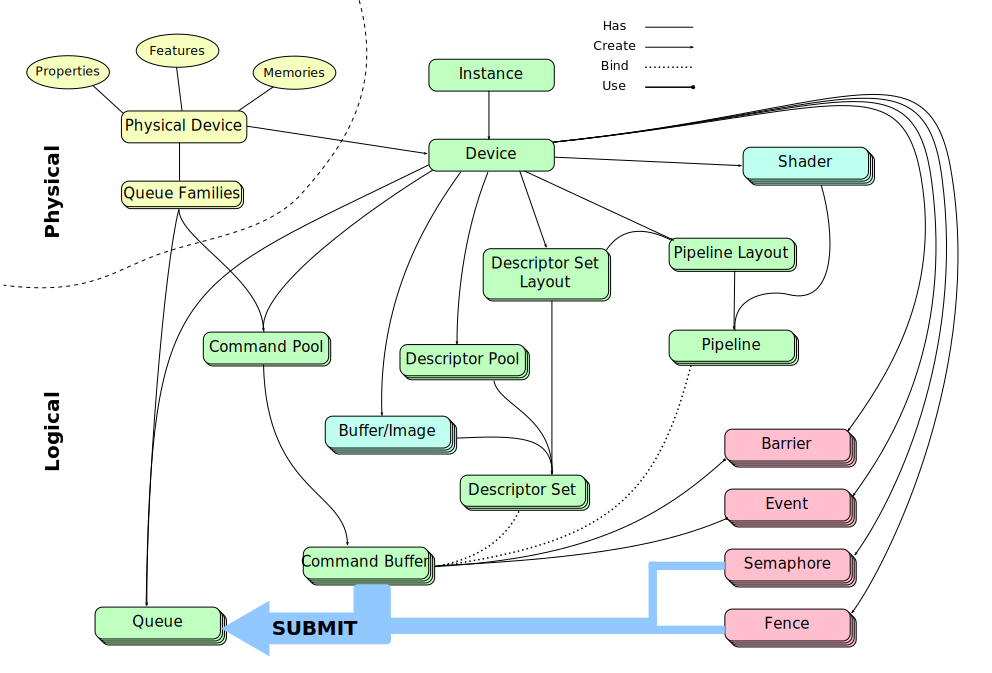

Vulkan So Far
=============

In these 5 tutorials, we have seen how Vulkan basically works.  There was no
graphics involved, and no distractions such as window management.  Still, there
was a lot to cover!  Tutorial 5 is rather basic and shows how to enable layers
and extensions.  As usual, see the source code for that.

So far, we have seen a handful of entities in Vulkan and their relationship.
This is summarized in the Figure below.

.

In summary, there are physical devices that Vulkan can enumerate, for example
your two graphics cards.  Each physical device has certain properties, features
and capabilities that Vulkan can tell you about.  The device performs actions
from queues, and each queue family supports a set of operations, such as
graphics or computation.

Vulkan needs to be instanced, which allows it to not have any global states.
From this instance, you can create a logical device for each physical device if
you so choose to.  All operations go through these logical devices.  There are
four main entities that need to be defined before any action could be taken.

- Command Buffers
- Descriptor Sets
- Pipelines
- Synchronization Primitives

Command buffers, allocated from command pools, are used to record graphics or
compute operations on descriptor sets it is bound to using the pipeline it is
bound to.  The recorded sequence of commands is eventually sent to a device
queue for execution.

Descriptor sets, allocated from descriptor pools, are instantiated according to
a defined layout and contain the actual data that is sent to the GPU, in the
form of images, buffers etc.

Pipelines are instantiated according to a defined pipeline layout as well,
which itself needs to know about the layout of descriptor sets that would be
used within the pipeline.  While descriptor sets carry data to the GPU,
pipelines carry programs aka shaders.

Synchronization primitives make sure memory accesses and execution between CPU
and GPU or within GPU are, well, synchronized.  Semaphores, barriers, events
and fences each help solve a different synchronization issue.  These primitives
are used when recording to a command buffer and submitting it to a queue for
execution.
